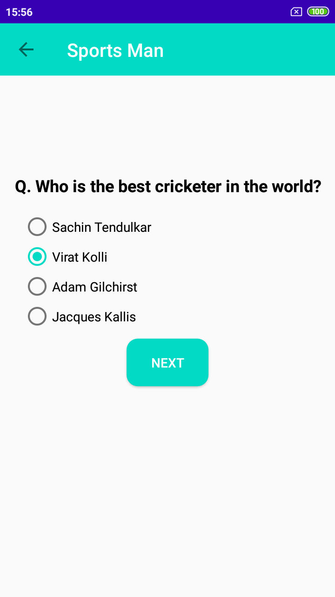
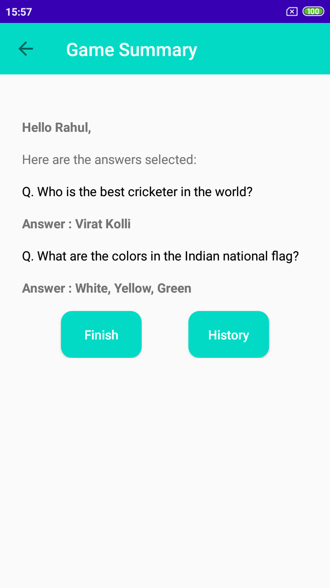
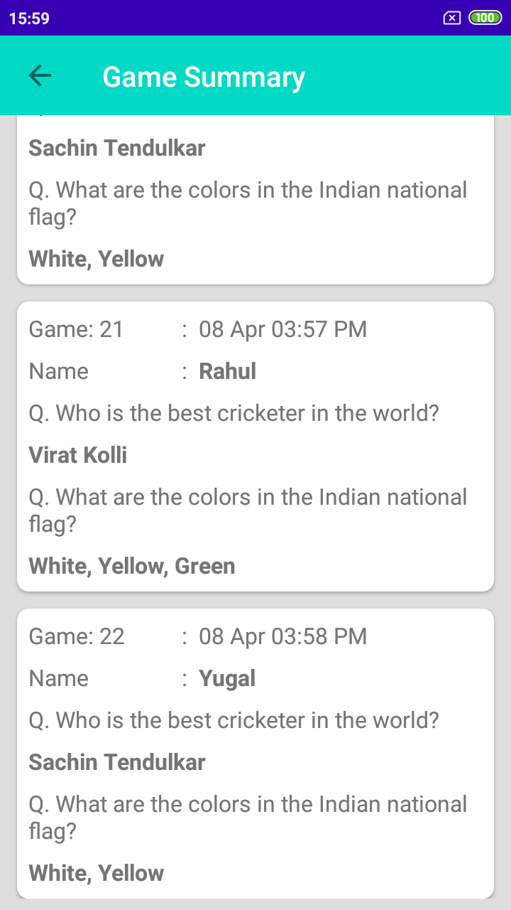

Trivia App
----------

- [Release apk](APK/TriviaApp.apk) for check/Try app.

### App Packages:

- activity: all activity of project.
- adapter: game adapter.
- database: database files.
- model: all model class of project.
- utils: files which can be used in entire project.
 
Screenshot
----

<table>
  <tr>
    <td>
      
    </td>
    <td>
      
    </td>
    <td>
      
    </td>
  </tr>
</table>

<table>
  <tr>
    <td>
      
    </td>
    <td>
      
    </td>
    <td>
      
    </td>
  </tr>
</table>

### Credits:
- App Logo/Icons made by <a href="https://www.flaticon.com/authors/good-ware" title="Good Ware">Good Ware</a> from <a href="https://www.flaticon.com/" title="Flaticon"> www.flaticon.com</a>

- [Clean Architecture Tutorial for Android: Getting Started](https://www.raywenderlich.com/3595916-clean-architecture-tutorial-for-android-getting-started)
- [Mvvm With Databinding](https://www.raywenderlich.com/636803-mvvm-and-databinding-android-design-patterns)
