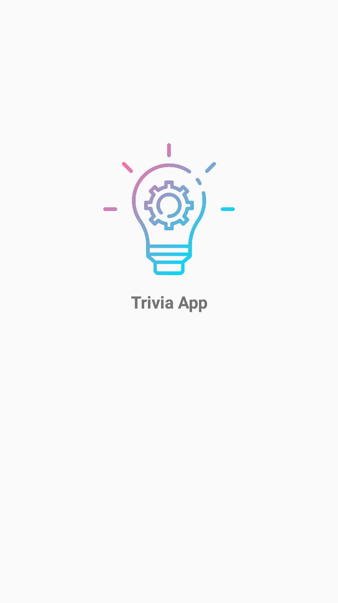
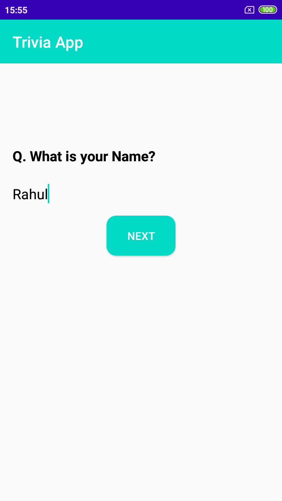
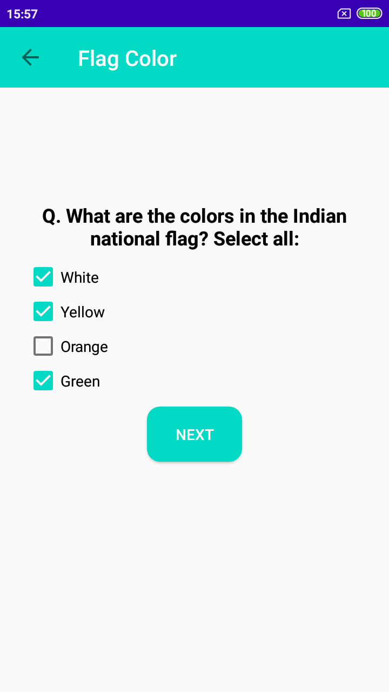

Trivia App
----------

- [Release apk](APK/TriviaApp.apk) for check/Try app.

### App Packages:

- activity: all activity of project.
- adapter: game adapter.
- database: database files.
- model: all model class of project.
- utils: files which can be used in entire project.

Screenshot
----

<table>
  <tr>
    <td>
      
    </td>
    <td>
      
    </td>
    <td>
      
    </td>
  </tr>
</table>

<table>
  <tr>
    <td>
      
    </td>
    <td>
      
    </td>
    <td>
      
    </td>
  </tr>
</table>

### Clean Arch pattern with MVVM work flow:

- **core package:** This package contain file
  - **data:** Abstract definition of all the data sources, repository section
  - **domain:** Contains the business logic of the app. Model class of project
  - **interactor:** Sometimes called interactors. Defines actions the user can trigger. function/features of the project

- **framework package:** Implements interaction with the Android SDK and provides concrete implementations for the data layer. This project contain database files and files to connect core package to project.

- **presentation package:** A layer that interacts with the UI. This package contain all the view and viewmodel related files.

#### App work flow

- **Data insertion:**
FlagActivity -> GameViewModel -> Interactors -> AddTriviaData -> TriviaRepository -> TriviaDataSource -> RoomDbTriviaDataSource -> TriviaDao

- **Data fetching:**
SummaryActivity -> GameViewModel -> Interactors -> GetTriviaData -> TriviaRepository -> TriviaDataSource -> RoomDbTriviaDataSource -> TriviaDao

- **FlagActivity ->** Activity (Ui) it will take user input data and pass that data to ViewModel.

- **SummaryActivity ->** Activity (Ui) it will show data to user, it will get data form ViewModel.

- **GameViewModel ->** ViewModel is the intersection between view and data section. In clean arch ViewModel work as direct link between clean arch and MVVM pattern. It will help to insert and fetch data (share data) form interactors.

- **Interactors ->** Defines actions the user can trigger. function/features of the project like insert, fetching data.

- **AddTriviaData ->** It is a interactor class that show a feature which is adding data into database.

- **GetTriviaData ->** It is a interactor class that show a feature which is fetching data from database.

- **TriviaRepository ->** Repository class provides methods for accessing the data that delegate to DataSource. The repository is an abstraction of Data Access and it does not depend on details. It depends on abstraction.

- **TriviaDataSource ->** The interface for describing project all features like insert and fetch data, that will be implemented by Framework layer.

- **RoomDbTriviaDataSource ->** It help to insert and fetch data form local database by interacting with Room Db DAO class. It is a data sources file that delegate and persist data in the database, using the Room library. Basically it act as medium to perform local database CURD operation.
In this model class will send or receive data in database in database model class.  

- **TriviaDao ->** Room database DAO file perform task of data manipulations.

### Credits:
- App Logo/Icons made by <a href="https://www.flaticon.com/authors/good-ware" title="Good Ware">Good Ware</a> from <a href="https://www.flaticon.com/" title="Flaticon"> www.flaticon.com</a>

- [Clean Architecture Tutorial for Android: Getting Started](https://www.raywenderlich.com/3595916-clean-architecture-tutorial-for-android-getting-started)
- [Mvvm With Databinding](https://www.raywenderlich.com/636803-mvvm-and-databinding-android-design-patterns)
- [github code](https://github.com/sabiou/starter-clean-architecture)
- [mvvm-architecture-viewmodel-and-livedata](https://proandroiddev.com/mvvm-architecture-viewmodel-and-livedata-part-1-604f50cda1)
- [mvvvm github sample](https://github.com/hazems/mvvm-sample-app)
- [view model offical doc](https://developer.android.com/topic/libraries/architecture/viewmodel)
